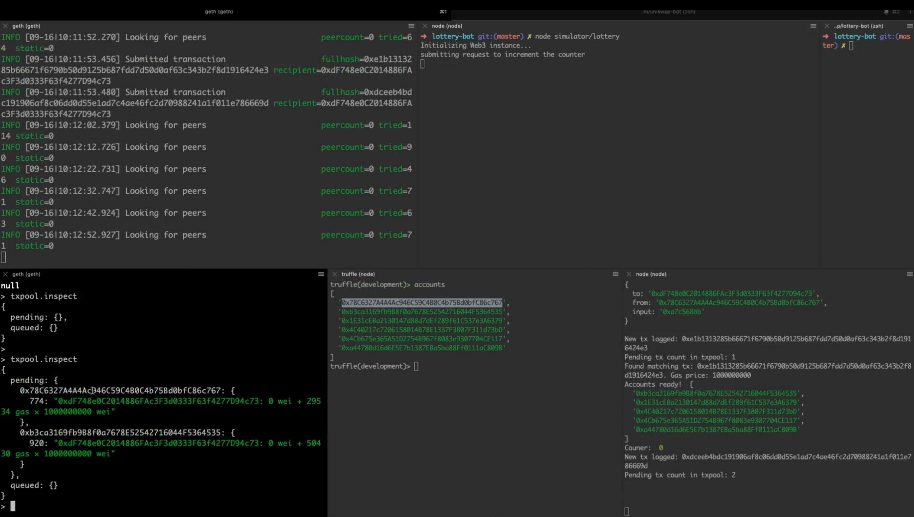

# Lottery Bot

Here is how to get this bot started on a development envirnoment.

Exercise inspired from [this article here](https://medium.com/@amanusk/the-fastest-draw-on-the-blockchain-bzrx-example-6bd19fabdbe1).

### Start geth and unlock the accounts

Please refer to the README for Geth on how to install and setup on your [local dev environment](./geth/dev/README.md) or to a [testnet environment](./geth/ropsten/README.md).

Run the command below. You will need to create your own accounts in Geth and unlock them.

```
geth --datadir ./geth-test --networkid 15
```

Attach a terminal to the local geth node

```
geth attach ./geth-test/geth.ipc
```

### Add helper scripts to geth

In the geth console that you are attached to, drop this into the console

```
loadScript('./geth/checkAllBalances.js')
loadScript('./geth/checkWork.js')
loadScript('./geth/unlockAllAccounts.js')
```

Feel free to take a look at each of these scripts inthe [geth](./geth) folder of this repo.

At this point you might need to create some local test accounts set one as the `setEtherbase`, mine and transfer funds as well as manually unlock these accounts. You can do so by following the instructions [here](geth/dev/README.md).

### Run the loaded functions

The `checkWork` function ensures that gethonly mines when there are transactions in the txpool. Note you need to load the script (using `loadScript` as shown above) before you can run this in the geth console.

```
checkWork()
```

Unlock all the accounts using the `unlockAllAccounts` script. This script makes some assumtions about the accounts that you have created and the passwords you have used. Feel free to modify this script to suite your own accounts setup.

```
unlockAllAccounts()
```

For fun, you can also run the `checkAllBalances()` function too:

```
checkAllBalances()
```

### From the geth terminal, inpect the txpool which should be empty

Take a look at the txpool - it should be empty

```
txpool.inspect
```

### Start the txSimulater

This simulates small transactions of ether between two accounts.

```
node simulator/traffic
```

### Initialize the Bot

Be sure to have your `.env` file in the root of this project and correctly filled out.

```
node bot/init
```

### Call releaseNextIncrement as the owner of the lottery contract

```
node simulator/lottery
```

If you see `execution reverted: The counter needs to be incremented first` then you need to manually run the `increment()` function on the smart contract using `truffle console` terminal (see below).

### Check the bot output

You should see that the SniperBot fires a number of transactions. One of them will go through. Both the bot and the lottery simulator show the latest block after. This *usually* is the block that both transactions were mined in.

### Review the CounterContract results

In truffle console window run. The winner should be the bot.

```
sc = await SimpleCounter.deployed()
(await sc.getCounter()).toString()
counter = await sc.getCounter()
sc.winners(counter)   // shows the address of that winner
sc.winners(counter+1) // should be an unclaimed slot (address 0x0)
```

If you need to manually increment the counter then run that function as follows

```
sc.increment()
```

### Terminal screen capture

I had many terminal windows open while testing this:

</img>
